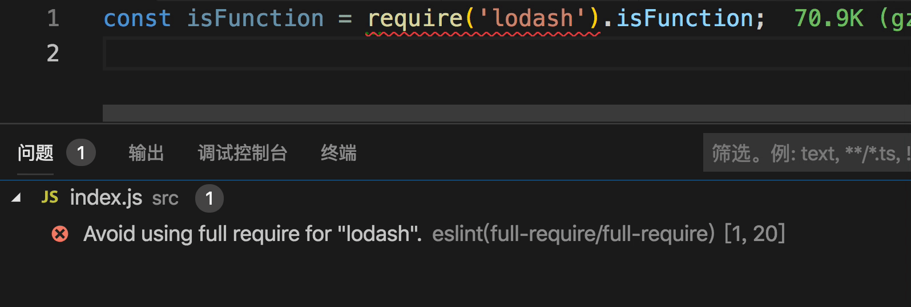

# eslint-plugin-pangu-comment

Eslint check for full require. e.g., lodash.



## Installation

You'll first need to install [ESLint](http://eslint.org):

```
$ npm i eslint --save-dev
```

Next, install `eslint-plugin-full-require`:

```
$ npm install eslint-plugin-full-require --save-dev
```

**Note:** If you installed ESLint globally (using the `-g` flag) then you must also install `eslint-plugin-full-require` globally.

## Usage

Add `full-require` to the plugins section of your `.eslintrc` configuration file. You can omit the `eslint-plugin-` prefix:

```json
{
    "plugins": [
        "full-require"
    ]
}
```


Then configure the rules you want to use under the rules section.

```json
{
    "rules": {
        "full-require/full-require": ["error", "lodash"]
    }
}
```

```json
{
    "rules": {
        "full-require/not-allow": ["error", "lodash"]
    }
}
```

## Options

You can assign multiple module in an array,
also support glob expressions by [minimatch](https://github.com/isaacs/minimatch).
For example:
```
{
    "rules": {
        "full-require/full-require": ["error", "lodash", "underscore"]
        "full-require/not-allow": ["error", "lodash/fp/**"]
    }
}
```


## Supported Rules

* **full-require**
    message: `Avoid using full require for "{{ module }}".`

* **not-allow**
    message: `Avoid require: "{{ module }}".`

## License

[MIT](http://opensource.org/licenses/MIT)

Copyright (c) 2019-present, zhengjiaqi